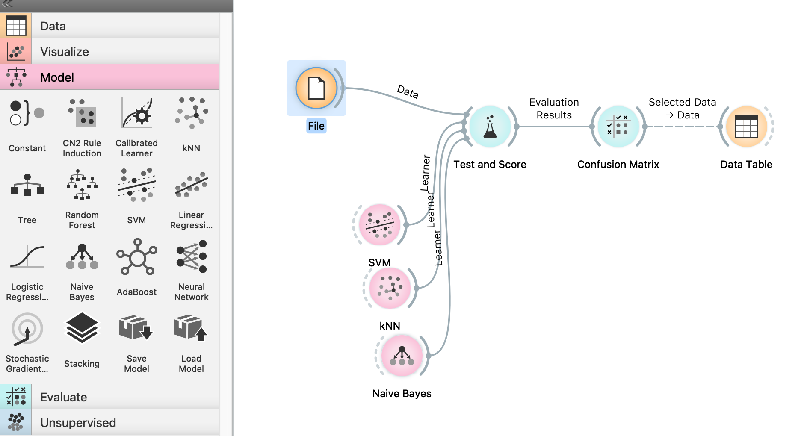

# Lab 9 - Machine Lerning with Orange and SkLearn

## Pre Lab requirements

* In you laptop, install Orange in anaconda Navigator

## Goal 1 - Orange Python - Create machine learning pipelines using Orange

### Compare classifiers performance

Create from scratch a classification pipeline with the following widgets:

* File
* Test and Score
* Confusion Matrix
* Data Table

They should be connected sequentially.

Then connect several classifiers to the Test and Score Module:

* SVM
* kNN
* Naive Bayes

The structure should be similar to:

Use the iris data set (selected in the File widget)

### Test the best features

Use the widget select columns (from Data panel in Orange).

Verify what is the single best features for the iris dataset.

### Decision Tree

Recreate the classifier with only a decision classifier. Use the decision tree visualizer (in the Orange panels: Visualize -> Tree Viewer )

### Regression

Recreate the pipeline to use the housing dataset [dataset description](https://www.cs.toronto.edu/~delve/data/boston/bostonDetail.html)

Start by using PCA widget (in Unsupervized panel) to make a dimensionality reduction to 3 principal components.

Use linear regression widget to create a model for the data.

Evaluate in the test and score widget

## Goal 2 - SkLearn

Use spyder to create a classifier

instantiate naive bayes and knn classifiers:

sklearn.naive_bayes.GaussianNB
sklearn.neighbors.KNeighborsClassifier

Load the digits dataset (datasets.load_digits() [dataset description](https://scikit-learn.org/stable/auto_examples/datasets/plot_digits_last_image.html) ), and separate into training and testing datasets.

Then use the functions in each classifiers

* fit (to train)
* predict (to test the trained classifier)

To evaluate the performance of the classifier use the functions:

* metrics.classification_report
* metrics.confusion_matrix

Use this [example](https://scikit-learn.org/stable/auto_examples/classification/plot_digits_classification.html#sphx-glr-auto-examples-classification-plot-digits-classification-py) in case of need. 
